# Shape Up AI Native

> Complete guide to adapting Basecamp's Shape Up methodology for AI-native software development teams

[](http://creativecommons.org/licenses/by/4.0/)

---

## ⚠️ Important Notice

**This is NOT an official Basecamp project.**

This is an adaptation of the [original Shape Up methodology](https://basecamp.com/shapeup) by Basecamp, reimagined for the age of AI coding agents.

By [Sérgio Lindolfo Ferreira](https://linkedin.com/in/sergiolindolfoferreira) — 30+ years building software, now exploring how Shape Up principles evolve when AI agents join your development team.

---

## 🎯 What is Shape Up AI Native?

Shape Up (2019) revolutionized product development with:
- **6-week cycles** instead of endless sprints
- **Shaping** work before building
- **Betting** instead of backlogs
- **Team autonomy** and accountability

But in 2026, **the game has changed:**
- AI agents build code 10-100x faster than humans
- Developers review instead of write
- Cycles compress from weeks to days
- The bottleneck shifts from coding to validation

**Shape Up AI Native** adapts these timeless principles for AI-augmented teams.

---

## 🔄 Workflow at a Glance

```mermaid
%%{init: {'theme':'base', 'themeVariables': { 'primaryColor':'#FFE5B4','secondaryColor':'#E3F2FD','tertiaryColor':'#F3E5F5','primaryBorderColor':'#FF6B6B','secondaryBorderColor':'#4ECDC4','tertiaryBorderColor':'#95E1D3'}}}%%

graph TD
    Start([🎯 Shape Up AI Native Workflow]):::startNode
    
    %% SHAPING PHASE
    Start --> Shaping[🔨 SHAPING<br/>Basecamp]:::shapingNode
    Shaping --> ShapingWork[Problem Definition<br/>+ Appetite<br/>+ Solution Sketch]:::workNode
    ShapingWork --> PitchOut[📄 pitch.md]:::artifactNode
    
    %% BETTING PHASE
    PitchOut --> Betting[🎲 BETTING<br/>Basecamp]:::bettingNode
    Betting --> BettingWork[Review Pitches<br/>+ Commit Resources<br/>+ Assign Teams]:::workNode
    BettingWork --> ApprovedPitch[✅ Approved Pitch]:::artifactNode
    
    %% BUILDING PHASE (Claude Code)
    ApprovedPitch --> Building[🚀 BUILDING<br/>GitHub + Claude Code]:::buildingNode
    
    %% SPEC MODE
    Building --> SpecMode[📝 SPEC MODE]:::claudeNode
    SpecMode --> SpecWork[Pitch → Technical Spec<br/>Requirements + Constraints<br/>Architecture Decisions]:::claudeWork
    SpecWork --> SpecOut[📋 spec.md]:::artifactNode
    
    %% PLAN MODE
    SpecOut --> PlanMode[📋 PLAN MODE]:::claudeNode
    PlanMode --> PlanWork[Spec → Task Breakdown<br/>Define Scopes<br/>Estimate Complexity]:::claudeWork
    PlanWork --> PlanOut[📑 plan.md<br/>+ scopes/]:::artifactNode
    
    %% IMPLEMENT MODE
    PlanOut --> ImplMode[💻 IMPLEMENT MODE]:::claudeNode
    ImplMode --> ImplWork[Plan → Code<br/>TDD + Reviews<br/>Pull Requests]:::claudeWork
    ImplWork --> ImplOut[✨ Working Features<br/>+ Tests]:::artifactNode
    
    %% SHIPPING PHASE
    ImplOut --> Shipping[📦 SHIPPING<br/>Azure DevOps]:::shippingNode
    Shipping --> ShipWork[Code Review<br/>+ Merge to Main<br/>+ Deploy Pipeline]:::workNode
    ShipWork --> Release[🎉 Production Release]:::releaseNode
    
    %% Cooldown feedback loop
    Release -.->|Learnings & Bugs| Shaping
    
    %% STYLE DEFINITIONS
    classDef startNode fill:#4A90E2,stroke:#2E5C8A,stroke-width:3px,color:#fff
    classDef shapingNode fill:#FF6B6B,stroke:#C92A2A,stroke-width:3px,color:#fff
    classDef bettingNode fill:#FAB005,stroke:#F08C00,stroke-width:3px,color:#000
    classDef buildingNode fill:#51CF66,stroke:#2F9E44,stroke-width:3px,color:#fff
    classDef claudeNode fill:#845EF7,stroke:#5F3DC4,stroke-width:3px,color:#fff
    classDef shippingNode fill:#FF922B,stroke:#E8590C,stroke-width:3px,color:#fff
    classDef workNode fill:#E3F2FD,stroke:#64B5F6,stroke-width:2px,color:#000
    classDef claudeWork fill:#F3E5F5,stroke:#BA68C8,stroke-width:2px,color:#000
    classDef artifactNode fill:#FFF9DB,stroke:#FFD43B,stroke-width:2px,color:#000
    classDef releaseNode fill:#69DB7C,stroke:#37B24D,stroke-width:3px,color:#fff
```



**Key insight:** What Shape Up calls "Building" becomes **3 distinct phases** (Spec → Plan → Implement) when working with AI agents. This gives agents the clarity they need at each step.

**Want the details?** See **[Development Workflow Guide](docs/development-workflow.md)** for the complete step-by-step process.

---

## 🚀 Quick Start: Choose Your Path

### 🆕 New to Shape Up?

**Start here:** Understand the methodology first

1. **[Principles](docs/principles.md)** — What is Shape Up AI Native?
2. **[Original Shape Up Book](https://basecamp.com/shapeup)** — Read the original (2-3 hours)
3. Come back and see how it adapts for AI agents

### 🏗️ Ready to Implement?

**Follow this path:** From zero to shipping with AI agents

1. **[Create Your AI Programmer](docs/agent-setup-guide.md)** — Build an AI agent from scratch (Mac mini + OpenClaw + Claude)
2. **[Set Up Basecamp](docs/basecamp-implementation.md)** — Configure Shape Up workflow in Basecamp
3. **[Shape Your First Pitch](docs/shaping.md)** — Learn to shape work for AI agents
4. **[Run Your First Cycle](docs/building.md)** — Agent builds, you review
5. **[Real Example](examples/performance-dashboard/pitch.md)** — See a complete shaped pitch

### 📖 Using It Already?

**Deep dives and references:**

- **[Shaping Guide](docs/shaping.md)** — Master the art of shaping for AI
- **[Betting Guide](docs/betting.md)** — Prioritize when agents move fast
- **[Building Guide](docs/building.md)** — Agent + human collaboration workflow
- **[Tools Guide](docs/tools.md)** — Basecamp, GitHub, CI/CD setup
- **[Templates](templates/)** — Copy-paste templates for pitches, scopes, kickoffs

---

## 📚 Complete Documentation

### 🎓 Understanding Shape Up AI Native

**Core concepts and philosophy:**

| Document | What You'll Learn | Time |
|----------|-------------------|------|
| **[Principles](docs/principles.md)** | What changes, what stays the same | 10 min |
| **[Shaping](docs/shaping.md)** | How to shape work for AI agents | 20 min |
| **[Betting](docs/betting.md)** | How to prioritize when agents move fast | 15 min |
| **[Building](docs/building.md)** | Agent + human workflow during cycles | 15 min |
| **[Development Workflow](docs/development-workflow.md)** | Complete Pitch → Code process (Spec → Plan → Implement) | 30 min |
| **[Tools](docs/tools.md)** | Basecamp, GitHub, and tool setup | 10 min |

**Total:** ~100 minutes to understand the full methodology

---

### 🛠️ Implementation Guides

**Step-by-step setup instructions:**

| Guide | What You'll Build | Time |
|-------|-------------------|------|
| **[Agent Setup Guide](docs/agent-setup-guide.md)** | Create an AI programmer from scratch | 2 hours |
| **[Basecamp Implementation](docs/basecamp-implementation.md)** | Configure Shape Up workflow | 30 min |

**Total:** ~2.5 hours to go from zero to ready

**What you'll have:**
- ✅ Working AI agent on Mac mini
- ✅ GitHub account + repository access
- ✅ Basecamp project configured
- ✅ Ready to shape and ship

---

### 📝 Templates & Examples

**Copy these to start fast:**

| Resource | Use This For | Format |
|----------|--------------|--------|
| **[Pitch Template](templates/pitch-template.md)** | Shaping new features | Markdown |
| **[Spec Template](templates/spec-template.md)** | Pitch → Technical specification | Markdown |
| **[Plan Template](templates/plan-template.md)** | Spec → Task breakdown | Markdown |
| **[PR Template](templates/pr-template.md)** | Pull Request descriptions | Markdown |
| **[Scope Template](templates/scope-template.md)** | Breaking work into chunks | Markdown |
| **[Kickoff Template](templates/cycle-kickoff-template.md)** | Starting a cycle | Markdown |
| **[Performance Dashboard Example](examples/performance-dashboard/pitch.md)** | Real shaped pitch | Complete |

---

## 🏢 Who's Using This

**[PILL](https://madebypill.com)** — Software engineering & applied AI company in Portugal
- 4-person technical team + AI agents
- Building a real estate management platform
- Using 1-2 week cycles with continuous PR review

**[Your Company Here?]** — [Share your story](CONTRIBUTING.md)

---

## 🔑 Key Differences from Original Shape Up

| Aspect | Shape Up (2019) | Shape Up AI Native (2026) |
|--------|-----------------|---------------------------|
| **Cycle length** | 6 weeks | 1-2 weeks |
| **Cool-down** | 1 week | 1-2 days |
| **Build speed** | Limited by team | 10-100x faster with agents |
| **Integration** | End of cycle | Continuous (via PRs) |
| **Role of humans** | Write code | Review code, deploy |
| **Bottleneck** | Development capacity | Review capacity |
| **Shaping importance** | Important | **Critical** (agents amplify mistakes) |
| **Hill charts** | Track progress | Track scope discovery |

**What stays the same:**
- ✅ Shaping before building
- ✅ Fixed time, variable scope
- ✅ Betting, not backlogs
- ✅ Circuit breaker (kill projects that don't ship)
- ✅ Appetite-driven development
- ✅ Team autonomy within boundaries

---

## 💡 How It Works: The Full Cycle

### 1. 🔨 Shaping (Continuous)

**What:** Define problems and rough solutions before committing

**Who:** Senior devs, product leads, founders

**Output:** Shaped pitches ready to bet on

**Guide:** [Shaping for AI Agents](docs/shaping.md)

**Template:** [Pitch Template](templates/pitch-template.md)

**Example:** [Performance Dashboard Pitch](examples/performance-dashboard/pitch.md)

---

### 2. 🎲 Betting (Start of Cycle)

**What:** Choose what to build next based on review capacity

**Who:** Decision makers (CTO, founders, senior team)

**Time:** 1-2 hours at cycle start

**Output:** Commitments for the cycle

**Guide:** [Betting When Agents Move Fast](docs/betting.md)

**Key question:** *Can we review this many PRs this cycle?*

---

### 3. 🚀 Building (1-2 Weeks)

**What:** AI agent implements, human reviews and deploys

**Who:** 
- **Agent:** Writes code, creates PRs
- **Human:** Reviews, tests, merges, deploys

**Process:**
1. Agent reads shaped pitch
2. Creates branch, implements feature
3. Opens PR with description
4. Human reviews (async, non-blocking)
5. Agent responds to feedback
6. Human merges when satisfied
7. Repeat until feature complete

**Guide:** [Agent + Human Workflow](docs/building.md)

---

### 4. 🧹 Cool-Down (1-2 Days)

**What:** Review, cleanup, prepare next cycle

**Activities:**
- Review what shipped (vs. what was bet)
- Fix critical bugs
- Refactor small things
- Shape new pitches
- Prepare for betting

**Guide:** [Basecamp Implementation](docs/basecamp-implementation.md#step-13-cool-down)

---

## 🎓 Who Should Read This?

### 👨‍💼 CTOs & Founders
**Read:** [Principles](docs/principles.md) → [Betting](docs/betting.md) → [Agent Setup Guide](docs/agent-setup-guide.md)

**Why:** Understand strategic shift from build capacity to review capacity

### 👨‍💻 Developers
**Read:** [Building](docs/building.md) → [Shaping](docs/shaping.md) → [Basecamp Implementation](docs/basecamp-implementation.md)

**Why:** Learn new role: reviewer + deployer instead of writer

### 📊 Product Managers
**Read:** [Shaping](docs/shaping.md) → [Principles](docs/principles.md) → [Examples](examples/performance-dashboard/pitch.md)

**Why:** Shaping becomes MORE critical when agents build fast

### 🏗️ Team Leads
**Read:** [Agent Setup Guide](docs/agent-setup-guide.md) → [Basecamp Implementation](docs/basecamp-implementation.md) → [Tools](docs/tools.md)

**Why:** Practical setup and team integration

### 🆕 Shape Up Newcomers
**Read:** [Original Shape Up Book](https://basecamp.com/shapeup) → [Principles](docs/principles.md) → [Shaping](docs/shaping.md)

**Why:** Understand foundation before adaptations

---

## 🤝 Contributing

We're building this in the open. Your experiences and insights help everyone!

**Ways to contribute:**
- 📖 **Share your experience:** How is Shape Up AI Native working for you?
- 📊 **Submit case studies:** Real examples from your team
- 📝 **Improve docs:** Found something unclear?
- 🌐 **Translate:** Help non-English speakers
- 🎨 **Add templates:** Share what works for you

See **[CONTRIBUTING.md](CONTRIBUTING.md)** for guidelines.

---

## 📖 Further Reading

### Original Shape Up

- **[Shape Up book](https://basecamp.com/shapeup)** — Free, online, ~2 hours
- **[Introduction](https://basecamp.com/shapeup/0.3-chapter-01)** — Quick overview
- **[Basecamp blog](https://basecamp.com/how-we-work)** — Additional context

### AI-Native Development

- **[Examples](examples/)** — Real pitches and implementations

### Community

- **[GitHub Discussions](https://github.com/sergiolindolfoferreira/shape-up-ai-native/discussions)** — Ask questions, share experiences
- **[Issues](https://github.com/sergiolindolfoferreira/shape-up-ai-native/issues)** — Report problems, suggest improvements

---

## 🗺️ Navigation Map

```
README.md (you are here)
│
├── Understanding
│   ├── docs/principles.md              → What changes, what stays
│   ├── docs/shaping.md                 → Shape work for AI agents
│   ├── docs/betting.md                 → Prioritize when fast
│   ├── docs/building.md                → Agent + human workflow
│   ├── docs/development-workflow.md    → Pitch → Code (Spec/Plan/Implement)
│   └── docs/tools.md                   → Basecamp + GitHub setup
│
├── Implementation
│   ├── docs/agent-setup-guide.md       → Create AI programmer
│   └── docs/basecamp-implementation.md → Set up workflow
│
├── Templates
│   ├── templates/pitch-template.md     → Shape new features
│   ├── templates/spec-template.md      → Pitch → Technical spec
│   ├── templates/plan-template.md      → Spec → Task breakdown
│   ├── templates/pr-template.md        → Pull Request descriptions
│   ├── templates/scope-template.md     → Break work into chunks
│   └── templates/cycle-kickoff-template.md → Start cycles
│
└── Examples
    └── examples/performance-dashboard/ → Complete real example
        └── pitch.md
```

**Quick links:**
- 🆕 New? → [Principles](docs/principles.md)
- 🏗️ Ready to build? → [Agent Setup](docs/agent-setup-guide.md) + [Basecamp Setup](docs/basecamp-implementation.md)
- 📖 Already using? → [Shaping](docs/shaping.md), [Betting](docs/betting.md), [Building](docs/building.md)
- 💻 Want details? → [Development Workflow](docs/development-workflow.md) (Pitch → Code step-by-step)

---

## 📜 License

This work is licensed under a [Creative Commons Attribution 4.0 International License](http://creativecommons.org/licenses/by/4.0/).

**You are free to:**
- **Share** — copy and redistribute in any medium or format
- **Adapt** — remix, transform, and build upon the material
- **Commercial use** — for any purpose, even commercially

**Under the following terms:**
- **Attribution** — Give appropriate credit to Sérgio Lindolfo Ferreira and link to the license

Repository code examples (if any): [MIT License](LICENSE)

---

## 🌟 About the Author

**Sérgio Lindolfo Ferreira**
- 30+ years in software development
- Founder of [PILL](https://madebypill.com) (Portugal) and [Borlantrix](https://www.borlantrix.com) (Estonia)
- Early adopter of Shape Up (since 2012)
- Now exploring AI-native development with coding agents

**Connect:**
- [LinkedIn](https://linkedin.com/in/sergiolindolfoferreira)
- [GitHub](https://github.com/sergiolindolfoferreira)

---

**Based on the original [Shape Up](https://basecamp.com/shapeup) methodology by Basecamp.**

**Built by:** [Vasco Gama](https://github.com/vasco-gama-dev) (AI agent) + Sérgio Ferreira (human)

Made with ❤️ in Portugal 🇵🇹
