# Shape Up AI Native Workflow

```mermaid
%%{init: {'theme':'base', 'themeVariables': { 'primaryColor':'#FFE5B4','secondaryColor':'#E3F2FD','tertiaryColor':'#F3E5F5','primaryBorderColor':'#FF6B6B','secondaryBorderColor':'#4ECDC4','tertiaryBorderColor':'#95E1D3'}}}%%

graph TD
    Start([🎯 Shape Up AI Native Workflow]):::startNode
    
    %% SHAPING PHASE
    Start --> Shaping[🔨 SHAPING<br/>Basecamp]:::shapingNode
    Shaping --> ShapingWork[Problem Definition<br/>+ Appetite<br/>+ Solution Sketch]:::workNode
    ShapingWork --> PitchOut[📄 pitch.md]:::artifactNode
    
    %% BETTING PHASE
    PitchOut --> Betting[🎲 BETTING<br/>Basecamp]:::bettingNode
    Betting --> BettingWork[Review Pitches<br/>+ Commit Resources<br/>+ Assign Teams]:::workNode
    BettingWork --> ApprovedPitch[✅ Approved Pitch]:::artifactNode
    
    %% BUILDING PHASE (Claude Code)
    ApprovedPitch --> Building[🚀 BUILDING<br/>GitHub + Claude Code]:::buildingNode
    
    %% SPEC MODE
    Building --> SpecMode[📝 SPEC MODE]:::claudeNode
    SpecMode --> SpecWork[Pitch → Technical Spec<br/>Requirements + Constraints<br/>Architecture Decisions]:::claudeWork
    SpecWork --> SpecOut[📋 spec.md]:::artifactNode
    
    %% PLAN MODE
    SpecOut --> PlanMode[📋 PLAN MODE]:::claudeNode
    PlanMode --> PlanWork[Spec → Task Breakdown<br/>Define Scopes<br/>Estimate Complexity]:::claudeWork
    PlanWork --> PlanOut[📑 plan.md<br/>+ scopes/]:::artifactNode
    
    %% IMPLEMENT MODE
    PlanOut --> ImplMode[💻 IMPLEMENT MODE]:::claudeNode
    ImplMode --> ImplWork[Plan → Code<br/>TDD + Reviews<br/>Pull Requests]:::claudeWork
    ImplWork --> ImplOut[✨ Working Features<br/>+ Tests]:::artifactNode
    
    %% SHIPPING PHASE
    ImplOut --> Shipping[📦 SHIPPING<br/>GitHub Actions]:::shippingNode
    Shipping --> ShipWork[Code Review<br/>+ Merge to Main<br/>+ Auto Deploy]:::workNode
    ShipWork --> Release[🎉 Azure App Services]:::releaseNode
    
    %% Cooldown feedback loop
    Release -.->|Learnings & Bugs| Shaping
    
    %% STYLE DEFINITIONS
    classDef startNode fill:#4A90E2,stroke:#2E5C8A,stroke-width:3px,color:#fff
    classDef shapingNode fill:#FF6B6B,stroke:#C92A2A,stroke-width:3px,color:#fff
    classDef bettingNode fill:#FAB005,stroke:#F08C00,stroke-width:3px,color:#000
    classDef buildingNode fill:#51CF66,stroke:#2F9E44,stroke-width:3px,color:#fff
    classDef claudeNode fill:#845EF7,stroke:#5F3DC4,stroke-width:3px,color:#fff
    classDef shippingNode fill:#FF922B,stroke:#E8590C,stroke-width:3px,color:#fff
    classDef workNode fill:#E3F2FD,stroke:#64B5F6,stroke-width:2px,color:#000
    classDef claudeWork fill:#F3E5F5,stroke:#BA68C8,stroke-width:2px,color:#000
    classDef artifactNode fill:#FFF9DB,stroke:#FFD43B,stroke-width:2px,color:#000
    classDef releaseNode fill:#69DB7C,stroke:#37B24D,stroke-width:3px,color:#fff
```

---

## Legend

| Phase | Tool | Purpose |
|-------|------|---------|
| 🔨 **SHAPING** | Basecamp | Define problem & rough solution |
| 🎲 **BETTING** | Basecamp | Commit resources to pitches |
| 🚀 **BUILDING** | GitHub + Claude Code | Execute: Spec → Plan → Implement |
| 📝 **SPEC MODE** | Claude Code | Pitch → Technical specification |
| 📋 **PLAN MODE** | Claude Code | Spec → Task breakdown |
| 💻 **IMPLEMENT MODE** | Claude Code | Plan → Code + Tests |
| 📦 **SHIPPING** | GitHub Actions + Azure | Review → Merge to Main → Auto Deploy |

---

## Artifacts Produced

- **pitch.md** - Shaped problem definition
- **spec.md** - Detailed technical specification
- **plan.md** - Implementation plan
- **scopes/** - Organized task breakdown
- **Features + Tests** - Working code with test coverage
- **Production Release** - Deployed application
