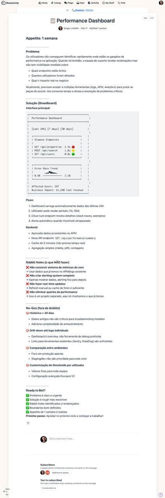

# Shaping for AI Agents

> How to shape work that AI agents can execute autonomously

---

## Why Shaping Matters (Even More)

With human developers:
- Under-specification → confusion, questions, delays
- Over-specification → kills creativity, wastes time

With AI agents:
- Under-specification → **wrong code, built confidently, at 100x speed**
- Over-specification → **still kills creativity** (agents need room too)

**The sweet spot is the same, but the consequences are amplified.**

---

## The Shaping Canvas

Every pitch needs these five elements:

### 1. **Problem**

**What are we solving? For whom?**

❌ Bad: "Users want better analytics"

✅ Good:
```
Current situation: Property managers can't see which 
listings are performing well. They check each listing 
individually to compare views.

Problem: Takes 30+ minutes daily to get a performance 
overview across 50+ listings.

Who: Property managers with 20+ active listings.
```

**For AI agents:** Clear problem statement prevents feature creep.

### 2. **Appetite**

**How much time do we want to spend?**

Not estimate (how long will it take?) but appetite (how much is it worth?).

Options:
- **Small batch:** 1-2 days (tiny feature, bug fix, small improvement)
- **Standard cycle:** 1 week (most features)
- **Big batch:** 2 weeks (major feature, complex integration)

**Never more than 2 weeks** (if bigger, split it)

**For AI agents:** Appetite prevents infinite optimization. Agent will fill available time.

### 3. **Solution (Rough)**

**What does it look like, at high level?**

**NOT:** Detailed wireframes, pixel-perfect mockups
**YES:** Breadboards, fat marker sketches, written descriptions

#### Breadboarding

Show affordances (actions) and connections, no visual design:

```
[ Listings Dashboard ]
   |
   +-- [Performance Overview Card]
   |      - Shows: Views, Inquiries, Bookings (last 7 days)
   |      - Click → drills down to listing detail
   |
   +-- [Listings Table]
          - Columns: Name, Views, Inquiries, Conversion %
          - Sort by any column
          - Click row → listing detail page
```

**For AI agents:** Breadboards give structure without constraining implementation.

#### Fat Marker Sketches

Quick, rough UI sketches with thick marker (forces high-level thinking):

```
╔════════════════════════════════════╗
║  Performance Dashboard             ║
╠════════════════════════════════════╣
║                                    ║
║  [======= Performance Card ======] ║
║  │ 2,450 views  │ 87 inquiries  │ ║
║  │ 12 bookings  │ 13.8% conv.   │ ║
║  [==============================] ║
║                                    ║
║  [====== Top Listings Table =====] ║
║  │ Name    │ Views │ Conv. │     ║
║  │ Villa A │ 450   │ 18%   │     ║
║  │ Apt B   │ 380   │ 12%   │     ║
║  │ ...     │ ...   │ ...   │     ║
║  [==============================] ║
╚════════════════════════════════════╝
```

**For AI agents:** Shows layout intent without pixel constraints.

### 4. **Rabbit Holes**

**What could go wrong? What are we NOT doing?**

Identify risks upfront:

**Example:**
```
Rabbit holes to avoid:
- Real-time updates (use daily aggregation instead)
- Custom date ranges (just last 7/30 days for v1)
- Export to PDF/Excel (v2 feature)
- Advanced filtering (just sort for now)

Technical unknowns:
- Performance data is in MongoDB, listings in PostgreSQL
  → Solution: Create daily aggregation job, store results 
     in PostgreSQL (agent can implement this pattern)
```

**For AI agents:** Prevents wandering into out-of-scope work.

### 5. **Boundaries**

**What's explicitly OUT of scope?**

❌ "Nice to have if time permits" (agent will add it!)

✅ Clear NO:
```
OUT OF SCOPE for v1:
- Custom date ranges
- Comparing across date periods
- Filtering by property type
- Exporting data
- Email notifications
```

**For AI agents:** Clear boundaries prevent scope creep.

---

## Shaping Workflow

### Step 1: Set Appetite (5 min)

"How much time is this worth?"

- Small win? → 1-2 days
- Meaningful feature? → 1 week
- Major capability? → 2 weeks

**If you can't decide:** Too vague, need more thinking.

### Step 2: Rough Out Elements (15-20 min)

Draw breadboard or fat marker sketch:
- What are the main screens/views?
- What actions can users take?
- How do they connect?

**Don't get pixel-perfect.** Thick marker or whiteboard only.

### Step 3: Find Rabbit Holes (10 min)

Walk through the solution:
- What could go wrong technically?
- What scope creep is likely?
- What dependencies exist?

Talk to technical expert if unsure.

### Step 4: De-Risk (5-10 min)

For each rabbit hole:
- Cut it (move to v2)
- Specify it (give clear approach)
- Accept it (if unavoidable)

**Goal:** No unknowns that could derail the agent.

### Step 5: Write Pitch (10 min)

Use [pitch template](../templates/pitch-template.md).

**Total time:** 45-60 minutes

---

## Shaping for Different Sizes

### Small Batch (1-2 days)

**Minimal shaping:**
- Problem (2-3 sentences)
- Solution (paragraph + simple sketch)
- Boundaries (what's out)

**Example:**
```
Problem: Users can't reorder images in listing gallery.

Solution: Add drag handles to each image in the gallery 
edit view. Drag to reorder. Save button updates order.

Out: Bulk upload, image editing, thumbnails preview.

Appetite: 2 days
```

### Standard Cycle (1 week)

**Full shaping:**
- All 5 elements (problem, appetite, solution, rabbit holes, boundaries)
- Breadboard or fat marker sketch
- Technical risks identified

**Example:** Performance dashboard (see above)

### Big Batch (2 weeks)

**Extra detail:**
- Multiple breadboards (one per major screen/flow)
- More technical specification
- Consider breaking into 2 smaller pitches

**Caution:** Big batches are risky. Prefer two 1-week cycles.

---

## AI-Specific Shaping Tips

### 1. **Be Explicit About Data**

AI agents need to know:
- Where data lives (which database/table)
- How to transform it
- Where to store results

**Example:**
```
Data flow:
1. Raw analytics → MongoDB (analytics_db.page_views)
2. Daily aggregation → PostgreSQL (listings.daily_stats)
3. Dashboard queries → PostgreSQL only
```

### 2. **Define Success Clearly**

What does "done" look like?

❌ "Dashboard should be performant"

✅ "Dashboard loads in <2s with 100 listings, queries use indexes"

### 3. **Specify Integration Points**

If touching existing code:

```
Integration:
- Add new route: GET /api/dashboard/performance
- Reuse existing auth middleware
- Return JSON matching ListingStatsDTO format
- Frontend: New page at /dashboard/performance
```

### 4. **Give Examples**

Agents love examples:

```
Example API response:
{
  "overview": {
    "totalViews": 2450,
    "totalInquiries": 87,
    "conversionRate": 0.138
  },
  "topListings": [
    {
      "id": 123,
      "name": "Villa Marina",
      "views": 450,
      "inquiries": 23,
      "conversionRate": 0.18
    }
  ]
}
```

### 5. **Prevent Over-Engineering**

Agents love to add features. Be explicit:

```
DO NOT:
- Add caching (not needed yet)
- Implement real-time updates (daily is fine)
- Create admin panel for this (use existing)
- Add GraphQL endpoint (REST is fine)
```

---

## Common Shaping Mistakes

### ❌ Too Vague

**Problem:** "Add dashboard"

**Why it fails:** Agent doesn't know what dashboard means.

**Fix:** Define what's in the dashboard, what it does, for whom.

### ❌ Too Detailed

**Problem:** Pixel-perfect mockups with exact colors, fonts, spacing

**Why it fails:** Agent wastes time on wrong details, no room for better ideas.

**Fix:** Fat marker sketch + design system reference.

### ❌ No Appetite

**Problem:** "Build analytics until it's good"

**Why it fails:** Infinite scope, never ships.

**Fix:** "1 week for basic dashboard, track if we need more."

### ❌ Missing Rabbit Holes

**Problem:** Didn't identify technical unknowns

**Why it fails:** Agent gets stuck, cycle overruns.

**Fix:** Walk through implementation with technical expert.

### ❌ Implicit Boundaries

**Problem:** "Would be nice if it also exported to Excel"

**Why it fails:** Agent treats "nice to have" as "must have."

**Fix:** Explicit OUT OF SCOPE section.

---

## Real Example: Pitch in Basecamp

Here's what a well-shaped pitch looks like in practice:



This pitch demonstrates all five key elements:

1. **Problem:** Clear description of user pain (performance visibility)
2. **Appetite:** 1 week, explicitly stated upfront
3. **Solution:** Breadboard sketch + workflow description
4. **Rabbit Holes:** Explicit "what NOT to do" list
5. **Boundaries:** "No-Gos" section with out-of-scope items

Notice:
- ✅ Rough enough to allow implementation choices
- ✅ Detailed enough to prevent wrong direction
- ✅ Technical risks identified and addressed
- ✅ Clear success criteria ("Ready to Bet?" checklist)

This pitch is ready to hand to an AI agent for autonomous implementation.

---

## Shaping Checklist

Before betting on a pitch, verify:

- [ ] Problem is clear (3-5 sentences, specific user)
- [ ] Appetite is set (1-2 days, 1 week, or 2 weeks)
- [ ] Solution is rough (breadboard or fat marker)
- [ ] Rabbit holes identified (technical risks listed)
- [ ] Boundaries defined (OUT OF SCOPE section exists)
- [ ] Agent has enough context (data, integration, examples)
- [ ] Success criteria clear (what "done" looks like)
- [ ] No micro-specifications (room for agent to implement)

**If any checkbox fails:** Keep shaping.

---

## Example: Well-Shaped Pitch

See [example pitch](../examples/performance-dashboard/pitch.md) for a complete, well-shaped project ready for an AI agent.

---

**Next:** [How to Bet When Agents Move Fast](betting.md)

---

## Navigation

**← Previous:** [Principles](principles.md) (Understanding Shape Up AI Native)

**→ Next:** [Betting](betting.md) (How to prioritize and commit)

**📚 Implementation Guides:**
- [Basecamp Setup](basecamp-implementation.md) - Step-by-step workflow setup
- [Agent Setup](agent-setup-guide.md) - Create your AI programmer
- [Templates](../templates/pitch-template.md) - Copy-paste pitch template

**🎯 See It In Action:**
- [Real Pitch Example](../examples/performance-dashboard/pitch.md)
