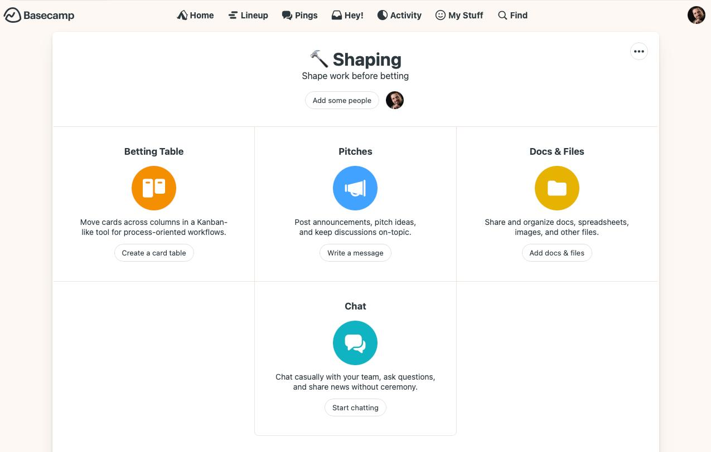
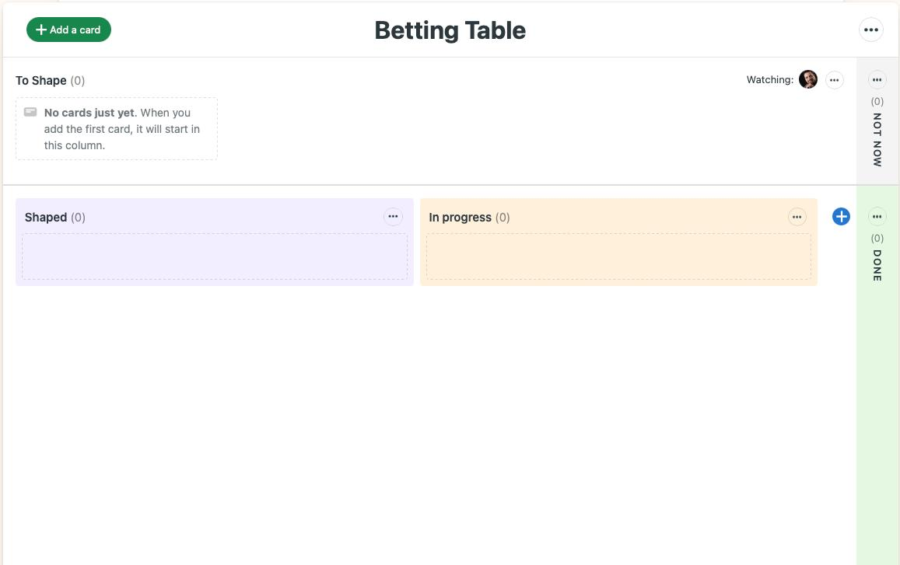

# Tools for AI-Native Shape Up

> Recommended tools and integrations

---

## Core Stack

### 1. **Basecamp** (Shaping + Betting)

**Why Basecamp:**
- Built by Shape Up creators
- Native Hill Charts support
- Message Boards for shaping discussions
- To-Do Lists for scopes
- Private teams for shaping work

**Setup:**
- **Shaping Team** (private): Shapers work on future cycles
- **Cycle Projects**: One project per cycle
- **To-Do Lists**: One list per scope
- **Hill Chart**: Track scope progress

**Alternative:** Linear, Notion, or any project tool with kanban

---

## Basecamp Setup Example

### Shaping Project

Create a **private project** called **"🔨 Shaping"** with these components:



**Components (in order):**

1. **Pitches** (Message Board)
   - Post shaped pitches here
   - One post = one complete pitch
   - Use [pitch template](../templates/pitch-template.md)

2. **Betting Table** (Card Table)
   - Visual workflow for betting decisions
   - Move cards between columns
   - See detailed setup below

3. **Docs & Files**
   - Store pitch templates
   - Keep reference materials
   - Upload relevant documents

4. **Chat** (Campfire)
   - Quick discussions during shaping
   - Async communication
   - Ask questions without ceremony

**Privacy:** Keep this project **private** (only shapers access)

---

### Betting Table Setup

The **Betting Table** is a Card Table (Kanban) for managing the betting workflow:



**Columns:**

1. **To Shape** (left)
   - Raw ideas that need shaping
   - Not ready for betting yet
   - Unstructured, early-stage

2. **Shaped** (center-left)
   - Pitches ready to bet on
   - Problem defined, appetite set
   - Solution roughed out
   - Rabbit holes identified

3. **In Progress** (center)
   - Current cycle work
   - Reused every cycle (don't create "Cycle 1", "Cycle 2", etc.)
   - Shows what's being built NOW

4. **DONE** (right side)
   - Shipped features
   - Completed and deployed
   - Historical record

5. **NOT NOW** (far right)
   - Declined pitches
   - Backburner ideas
   - Maybe revisit later

**Workflow:**

```
New idea → To Shape
         ↓ (after shaping)
      Shaped
         ↓ (betting decision)
    In Progress  OR  NOT NOW
         ↓ (after shipping)
      DONE
```

**Key Principle:** 
- **Don't create columns per cycle** (Cycle 1, Cycle 2, etc.)
- **Reuse "In Progress"** for every cycle
- Track cycle history in **separate Projects**, not here

---

### Cycle Projects

For each cycle, create a **new project**:

**Naming:** `🚀 Cycle N - [Feature Name]`

**Examples:**
- `🚀 Cycle 1 - Dashboard Performance`
- `🚀 Cycle 2 - CSV Export`

**Inside each Cycle Project:**

1. **Message Board: "Kickoff"**
   - Post the pitch
   - Add context and scope
   - Link to shaped pitch from Shaping project

2. **To-Do Lists** (one per scope)
   - Discovered during work, not upfront
   - Keep items high-level
   - Example:
     ```
     Overview Card:
     - [ ] API endpoint implemented
     - [ ] Frontend component built
     - [ ] Tests passing
     - [ ] PR merged
     ```

3. **Hill Chart** (optional)
   - Track scope progress
   - Uphill = figuring it out
   - Downhill = executing

4. **Campfire**
   - Quick updates
   - "PR #45 ready for review"
   - Async communication during cycle

**After cycle ends:**
- Archive the project (keeps history)
- Start fresh with next cycle

---

### 2. **GitHub** (Building + Review)

**Why GitHub:**
- Pull Request workflow is perfect for agent + human collaboration
- Code review tools
- CI/CD integration
- Branch protection

**Setup:**
- **Branches**: `agent/scope-name` or `vasco/feature-x`
- **PR Template**: Include scope context
- **Required Reviews**: At least 1 human approval
- **Status Checks**: Tests must pass before merge
- **Protected Main**: No direct pushes

**Alternative:** GitLab, Bitbucket (similar features)

### 3. **CI/CD Pipeline**

**Essential:**
- Auto-run tests on every PR
- Auto-deploy to staging on merge to main
- Human-triggered production deploys

**Options:**
- GitHub Actions (integrated)
- GitLab CI
- CircleCI
- Azure DevOps

---

## Optional Tools

### Communication

**Slack/Discord:**
- PR notifications
- Deploy notifications
- Agent status updates

**Not needed:**
- Daily standups
- Sprint planning meetings
- Retrospectives (just do cycle review)

### Monitoring

**Production:**
- Error tracking (Sentry, Rollbar)
- Performance (DataDog, New Relic)
- User analytics (Mixpanel, Amplitude)

**Why:** Catch issues agents miss in testing

### Documentation

**Pitch Storage:**
- Basecamp (as Message Board posts)
- Notion (as database)
- GitHub Discussions
- Simple folder with markdown files

**Code Docs:**
- README.md in each repo
- Architecture decision records (ADRs)
- Auto-generated API docs (OpenAPI/Swagger)

---

## AI Agent Setup

### Requirements

Your AI agent needs:
- Access to codebase (git clone)
- Ability to create branches
- Ability to push commits
- Ability to open PRs
- (Optional) Ability to run tests locally

### GitHub Personal Access Token

**Scopes needed:**
- `repo` (full control of private repos)
- `workflow` (update GitHub Actions)
- `read:org` (if in organization)

**Setup:**
1. Generate token at github.com/settings/tokens
2. Store securely (agent's environment)
3. Configure git: `git config credential.helper store`

### Testing Environment

Agent should be able to:
- Run full test suite locally
- Spin up development server
- Verify changes work before PR

**Docker helps** (consistent environment)

---

## Basecamp Setup for Shape Up

### Structure

```
BASECAMP ACCOUNT
│
├── SHAPING TEAM (Private)
│   ├── Message Board: "Pitch Ideas"
│   │   └── Posts: One per raw idea
│   ├── Message Board: "Shaped Pitches"
│   │   └── Posts: One per shaped pitch (ready to bet)
│   └── Docs & Files: Templates, references
│
└── CYCLE PROJECTS (One per cycle)
    ├── Message Board: "Kickoff"
    │   └── Post: Pitch for this cycle
    ├── To-Do Lists: (One per scope)
    │   ├── Overview Card
    │   ├── Listings Table
    │   └── Performance Optimization
    ├── Hill Chart: Track scopes
    └── Campfire: Quick questions
```

### Templates

**Pitch Template** (Message Board post in "Shaped Pitches"):

```markdown
# [Feature Name]

**Appetite:** 1 week

## Problem
[3-5 sentences describing user problem]

## Solution
[Breadboard or fat marker sketch]

## Rabbit Holes
- [Known risk 1]
- [Known risk 2]

## No Gos
- [Out of scope 1]
- [Out of scope 2]

## Ready to bet?
- [ ] Problem is clear
- [ ] Solution is rough but solved
- [ ] Rabbit holes addressed
- [ ] Boundaries defined
```

**Kickoff Template** (Message Board post in Cycle Project):

```markdown
# Cycle N: [Feature Name]

**Duration:** [Start] - [End]
**Appetite:** [Days/weeks]
**Builder:** [Agent name]
**Reviewer:** [Human name]

## The Pitch
[Link to shaped pitch in Shaping Team]

## Scopes
Initial scope ideas (will evolve):
1. [Scope 1]
2. [Scope 2]
3. [Scope 3]

## How to track
- GitHub PRs: [Link to filter]
- Basecamp To-Dos: This project
- Hill Chart: See above

## Questions?
Post in Campfire or comment here.
```

---

## GitHub Setup

### Repository Structure

```
repo/
├── .github/
│   ├── workflows/
│   │   ├── test.yml (run tests on PR)
│   │   └── deploy-staging.yml (deploy on merge)
│   └── pull_request_template.md
├── src/
├── tests/
└── README.md
```

### PR Template

`.github/pull_request_template.md`:

```markdown
## Scope: [Name]

**Cycle:** [Cycle N]
**Pitch:** [Link to Basecamp pitch]

### What
[Brief description of what this implements]

### Why
[How it relates to the pitch]

### Testing
- [ ] Unit tests pass (`npm test`)
- [ ] Integration tests pass
- [ ] Tested manually (describe)

### Screenshots/Demo
[If UI change, add screenshots or video]

### Notes
[Any context for reviewer]
```

### Branch Protection

**Settings → Branches → Add rule:**

- Branch name: `main`
- [x] Require pull request before merging
- [x] Require approvals: 1
- [x] Require status checks to pass
  - [x] Tests
- [x] Require branches to be up to date
- [ ] Require conversation resolution (optional)

---

## Workflow Integration

### GitHub → Basecamp

**When PR opened:**
→ Post comment in Cycle Project Campfire

**When PR merged:**
→ Check off To-Do in relevant scope

**Options:**
- Zapier integration
- Custom webhook
- Manual (fine for small teams)

### Basecamp → GitHub

**When betting:**
→ Create GitHub Project board for cycle

**When scope defined:**
→ Create GitHub issue for tracking

**Manual is fine** (5 min of setup per cycle)

---

## Cost Estimates

### Minimal Setup (Free)

- GitHub: Free for public repos
- Basecamp: Free (1 project)
- GitHub Actions: 2000 min/month free
- **Total: $0/month**

### Small Team ($50-100/month)

- GitHub: $4/user/month (3 users = $12)
- Basecamp: $15/month (unlimited projects)
- CI/CD: Included or $20/month
- Monitoring: $25/month (basic)
- **Total: ~$72/month**

### Growing Team ($200-500/month)

- GitHub Team: $4/user × 10 = $40
- Basecamp: $15-99/month (depending on size)
- CI/CD: $50-100/month
- Monitoring + tools: $100-200/month
- **Total: ~$305/month**

---

## Tool Selection Criteria

**Must have:**
- Async collaboration (not meetings-based)
- Clear ownership (PRs, To-Dos)
- Audit trail (who did what, when)

**Nice to have:**
- Integrations between tools
- Mobile access
- Real-time updates

**Don't need:**
- Sprint planning tools
- Story point estimators
- Burn-down charts
- Time tracking (appetite is fixed)

---

## Getting Started

**Week 1:**
1. Set up GitHub repo with branch protection
2. Set up Basecamp (or alternative)
3. Create PR template
4. Configure CI/CD basic pipeline

**Week 2:**
5. Shape first pitch
6. Bet on it
7. Run first cycle
8. Refine tools based on learnings

**Don't over-tool.** Start minimal, add as needed.

---

**Next:** [Case Studies](case-studies.md)
